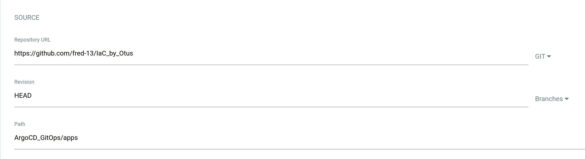
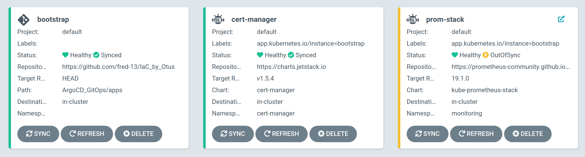

## Start minikube on kvm hypervisor and install ArgoCD tool for Kubernetes:

```
    $ minikube start --driver=kvm --cpus 8 --memory 8192

😄  minikube v1.23.2 on Linuxmint 20.2
✨  Using the kvm2 driver based on user configuration
💾  Downloading driver docker-machine-driver-kvm2:
    > docker-machine-driver-kvm2....: 65 B / 65 B [----------] 100.00% ? p/s 0s
    > docker-machine-driver-kvm2: 11.40 MiB / 11.40 MiB  100.00% 17.15 MiB p/s 
💿  Downloading VM boot image ...
    > minikube-v1.23.1.iso.sha256: 65 B / 65 B [-------------] 100.00% ? p/s 0s
    > minikube-v1.23.1.iso: 225.22 MiB / 225.22 MiB [] 100.00% 7.85 MiB p/s 29s
👍  Starting control plane node minikube in cluster minikube
💾  Downloading Kubernetes v1.22.2 preload ...
    > preloaded-images-k8s-v13-v1...: 511.69 MiB / 511.69 MiB  100.00% 13.33 Mi
🔥  Creating kvm2 VM (CPUs=8, Memory=8192MB, Disk=20000MB) ...
🐳  Preparing Kubernetes v1.22.2 on Docker 20.10.8 ...
    ▪ Generating certificates and keys ...
    ▪ Booting up control plane ...
    ▪ Configuring RBAC rules ...
🔎  Verifying Kubernetes components...
    ▪ Using image gcr.io/k8s-minikube/storage-provisioner:v5
🌟  Enabled addons: default-storageclass, storage-provisioner
🏄  Done! kubectl is now configured to use "minikube" cluster and "default" namespace by default

    $ minikube addons enable ingress

▪ Using image k8s.gcr.io/ingress-nginx/controller:v1.0.0-beta.3
▪ Using image k8s.gcr.io/ingress-nginx/kube-webhook-certgen:v1.0
▪ Using image k8s.gcr.io/ingress-nginx/kube-webhook-certgen:v1.0
🔎  Verifying ingress addon...
🌟  The 'ingress' addon is enabled

    $ minikube ip

192.168.39.150

    $ kubectl create namespace argocd

namespace/argocd created

    $ kubectl apply -n argocd -f https://raw.githubusercontent.com/argoproj/argo-cd/stable/manifests/install.yaml

customresourcedefinition.apiextensions.k8s.io/applications.argoproj.io created
customresourcedefinition.apiextensions.k8s.io/appprojects.argoproj.io created
serviceaccount/argocd-application-controller created
serviceaccount/argocd-dex-server created
serviceaccount/argocd-redis created
serviceaccount/argocd-server created
role.rbac.authorization.k8s.io/argocd-application-controller created
role.rbac.authorization.k8s.io/argocd-dex-server created
role.rbac.authorization.k8s.io/argocd-server created
clusterrole.rbac.authorization.k8s.io/argocd-application-controller created
clusterrole.rbac.authorization.k8s.io/argocd-server created
rolebinding.rbac.authorization.k8s.io/argocd-application-controller created
rolebinding.rbac.authorization.k8s.io/argocd-dex-server created
rolebinding.rbac.authorization.k8s.io/argocd-redis created
rolebinding.rbac.authorization.k8s.io/argocd-server created
clusterrolebinding.rbac.authorization.k8s.io/argocd-application-controller created
clusterrolebinding.rbac.authorization.k8s.io/argocd-server created
configmap/argocd-cm created
configmap/argocd-cmd-params-cm created
configmap/argocd-gpg-keys-cm created
configmap/argocd-rbac-cm created
configmap/argocd-ssh-known-hosts-cm created
configmap/argocd-tls-certs-cm created
secret/argocd-secret created
service/argocd-dex-server created
service/argocd-metrics created
service/argocd-redis created
service/argocd-repo-server created
service/argocd-server created
service/argocd-server-metrics created
deployment.apps/argocd-dex-server created
deployment.apps/argocd-redis created
deployment.apps/argocd-repo-server created
deployment.apps/argocd-server created
statefulset.apps/argocd-application-controller created
networkpolicy.networking.k8s.io/argocd-application-controller-network-policy created
networkpolicy.networking.k8s.io/argocd-dex-server-network-policy created
networkpolicy.networking.k8s.io/argocd-redis-network-policy created
networkpolicy.networking.k8s.io/argocd-repo-server-network-policy created
networkpolicy.networking.k8s.io/argocd-server-network-policy created

    $ kubectl get pods -n argocd

NAME                                 READY   STATUS    RESTARTS   AGE
argocd-application-controller-0      1/1     Running   0          29m
argocd-dex-server-5fc596bcdd-dl676   1/1     Running   0          29m
argocd-redis-5b6967fdfc-bht5b        1/1     Running   0          29m
argocd-repo-server-98598b6c7-v7f6j   1/1     Running   0          29m
argocd-server-5b4b7b868b-zpz82       1/1     Running   0          29m

```

## Then generate admin password for API server and go on WEB ui ArgoCD (https://localhost:8080/):

```
    $ kubectl -n argocd get secret argocd-initial-admin-secret -o jsonpath="{.data.password}" | base64 -d

BwTfRyAbhT-Fs06j

    $ kubectl port-forward svc/argocd-server -n argocd 8080:443

Forwarding from 127.0.0.1:8080 -> 8080
Forwarding from [::1]:8080 -> 8080

```

## Create new APP:

<br>

```
    $ kubectl get pods -n monitoring

NAME                                                        READY   STATUS    RESTARTS   AGE
alertmanager-kube-prometheus-stack-alertmanager-0           2/2     Running   0          37m
kube-prometheus-stack-grafana-75b47f5b45-nkgk6              2/2     Running   0          39m
kube-prometheus-stack-kube-state-metrics-7f996bfdc7-cds4z   1/1     Running   0          39m
kube-prometheus-stack-operator-657b774d6f-qh2p6             1/1     Running   0          39m
kube-prometheus-stack-prometheus-node-exporter-z7r56        1/1     Running   0          39m
prometheus-kube-prometheus-stack-prometheus-0               2/2     Running   0          37m
```

<br>
